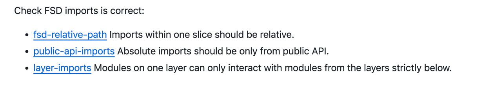

# eslint-plugin-kisszaya-fsd-plugin

Plugin to format code by fsd principles

## Installation

You'll first need to install [ESLint](https://eslint.org/):

```sh
npm i eslint --save-dev
```

Next, install `eslint-plugin-kisszaya-fsd-plugin`:

```sh
npm install eslint-plugin-kisszaya-fsd-plugin --save-dev
```

## Usage

Add `kisszaya-fsd-plugin` to the plugins section of your `.eslintrc` configuration file. You can omit the `eslint-plugin-` prefix:

```json
{
    "plugins": [
        "kisszaya-fsd-plugin"
    ]
}
```


Then configure the rules you want to use under the rules section.

```json
{
    "rules": {
        "kisszaya-fsd-plugin/rule-name": 2
    }
}
```


## Configurations

<!-- begin auto-generated configs list -->
TODO: Run eslint-doc-generator to generate the configs list (or delete this section if no configs are offered).
<!-- end auto-generated configs list -->


## Rules

<!-- begin auto-generated rules list -->
TODO: Run eslint-doc-generator to generate the rules list.
<!-- end auto-generated rules list -->



# eslint-fsd-plugin
